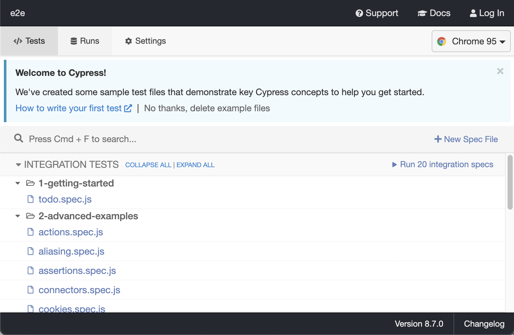
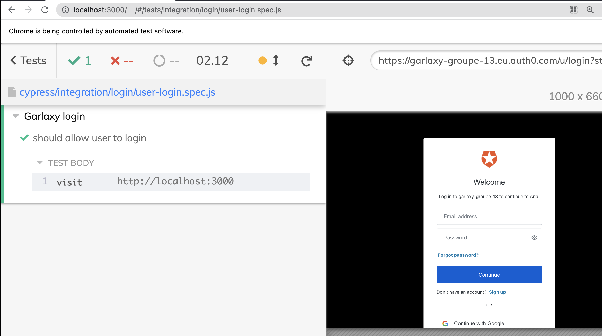

# QA workshop

This workshop is made for EPITA SIGL 2022 students of ARLA course.

You will learn how to:

- implement unit test in Node using [Jest](https://jestjs.io)
- implement basic fonctional in Node test using [Cucumber](https://cucumber.io)
- implement e2e test in Node using [Cypress.io](https://cypress.io)
- configure a CI environment
- integrate tests to your CD pipeline

## Step 1: Implement unit test

**Objective**: Write a non-regression unit test for your `utils` method in your web API.

Your API is using a paging system based on 2 query parameters `page` and `limit`.

The logic is written inside the function `extractPageOptions` of your group's project in `backend/src/utils.js` file.

You will write a set of unit test to make sure that the method works as expected.

### Install Jest

To implement unit tests, you will use a new node module called [Jest](https://jestjs.io).

> Note: You often encounter mainly two JavaScript testing frameworks: [Jest](https://jestjs.io) and [Mocha](https://mochajs.org).
> Those two tools serve same purpose, but we found that Jest offers a better development experience. This is important since developpers are often lazy to write tests!

To install [Jest](https://jestjs.io), install it like any other node modules (from your API project):

```sh
# From your backend/ folder:
# make sure you have correct node version activated
nvm use v16
# install the jest module
npm i --save-dev jest
# It should create a jest.config.js
```

Now, let's add a new script inside your `package.json` file to run test using jest when typing `npm test`:

```json
// ...
  "scripts": {
    // "build": ...,
    // ...,
    "test": "jest --passWithNoTests"
  }
```

Now try to run test typing `npm test` or `npm t`. You should see the following output:

```plain
> ...
> jest --passWithNoTests

No tests found, exiting with code 0
```

If you see this logs, it means you've correctly set Jest.

### Create unit test for `extractPageOptions`

Let's first create a simple unit test to check the expected behaviour of the `extractPageOption` fuction.

Create a new file `backend/src/utils.spec.js` with:

```js
import qs from "qs";
import { extractPageOptions } from "./utils";

describe("extractPageOptions", () => {
  it("should correctly extract page and limit options when present", () => {
    const validQuery = { page: "1", limit: "10" };
    const { page, limit } = extractPageOptions(validQuery);
    expect(page).toEqual(1);
    expect(limit).toEqual(10);
  });
});
```

Now run this test and make sure it's running without error:

```sh
# from backend/
# Both `npm t` and `npm test` are equivalent
npm test
# Output:
# > template-api@1.0.0 test ...
# > jest --passWithNoTests
#
#  PASS  src/utils.spec.js
#   extractPageOptions
#     ✓ should correctly extract page and limit options when present (3 ms)
#
# Test Suites: 1 passed, 1 total
# Tests:       1 passed, 1 total
# Snapshots:   0 total
# Time:        1.911 s, estimated 2 s
# Ran all test suites.
```

Now, to make sure test is correctly implemented, let's make it fail on purpose.
Replace `expect(page).toEqual(1);` by `expect(page).toEqual(1000);`, and run `npm test` again.

You should see an error like:

```log

> template-api@1.0.0 test ...
> jest --passWithNoTests

 FAIL  src/utils.spec.ts
  extractPageOptions
    ✕ should correctly extract page and limit options when present (5 ms)

  ● extractPageOptions › should correctly extract page and limit options when present

    expect(received).toEqual(expected) // deep equality

    Expected: 1000
    Received: 1

      10 |     };
      11 |     const { page, limit } = extractPageOptions(validQuery);
    > 12 |     expect(page).toEqual(1000);
         |                  ^
      13 |     expect(limit).toEqual(10);
      14 |   });
      15 |

      at Object.<anonymous> (src/utils.spec.ts:12:18)

Test Suites: 1 failed, 1 total
Tests:       1 failed, 1 total
Snapshots:   0 total
Time:        2.314 s
Ran all test suites.
npm ERR! Test failed.  See above for more details.
```

You can see that the test failed, as expected!

Revert changes to make it green again (`expect(page).toEqual(1);` instead of `expect(page).toEqual(1000);`)

Let's add new unit test to check if errors are correclty thrown when one of the option is missing:

```ts
// inside describe() after the first it()
// ...
it("should throw an error when page is missing", () => {
  const onlyLimit: qs.ParsedQs = {
    limit: "10",
  };
  expect(() => extractPageOptions(onlyLimit)).toThrowError(
    new Error("page needs to be a valid number")
  );
});

it("should throw an error when limit is missing", () => {
  const onlyPage: qs.ParsedQs = {
    page: "10",
  };
  expect(() => extractPageOptions(onlyPage)).toThrowError(
    new Error("limit needs to be a valid number")
  );
});
// ...
```

Now add a unit test to check if an error is thrown when a given option is not a valid number:

```ts
// ...
it("should throw an error when page is not a number", () => {
  const invalidPageNaN = {
    page: "page1",
    limit: "10",
  };
  expect(() => extractPageOptions(invalidPageNaN)).toThrowError(
    new Error("page needs to be a valid number")
  );
  // ...
});
```

Your turn to practice!

Try to implement a unit test to check that an error is thrown when the option page is a negative number:

```ts
it("should throw an error when page is negative", () => {
  // TODO: your turn to practice!
});
```

## Step 2: Implement functional test

**Objective**: Implement a functional test on your contractor API.

You will use [Cucumber](https://cucumber.io) to write [BDD](https://en.wikipedia.org/wiki/Behavior-driven_development) tests using the NodeJS implementation [Cucumber-js](https://cucumber.io/docs/installation/javascript/).

This tool seperates the test specification in seperated `.feature` files. Those features can be written by non-dev people in your team, and goes in the direction of BDD for writing tests.

This will be a nice functional test testing if the API works as expected, including the connection to the database.

### Start your API with PostgreSQL

Before starting the Cucumber specification, you should start your services on your local machine:
- you web API inside your `backend/` folder:
```sh
# from backend/
nvm use v16
node src/server.js
```
- your Postgres database (from previous workshop)
```sh
# from database/ (previous workshop)
cd posrtgres
docker-compose up -d
cd ../mongo
docker-compose up -d
# You should have your 2 database running ; to verify
# just type `docker ps` command and you should see your databases containers
```

### Cucumber

- Copy the whole `cucumber` folder at the root of your group's repository.

> Note: you should have cucumber/ at the same level of backend/ and frontend/ 

- move to the cucumber folder, and install Node modules:
```sh
# From cucumber/ folder
nvm use v16
npm install
```

Then, have a look at the test inside the [cucumber/features](cucumber/features) folder:
- [The feature file in cucumber/features/contractor-comments.feature](cucumber/features/contractor-comments.feature): This cucumber feature describes in a templated way how the contractor API should behave when a user calls the API with different `contractor`, `page` and `limit` options.
- [Then, the corresponding step definitions in cucumber/features/contractor-comments.feature](cucumber/features/contractor-comments.feature): The code implementing the corresponding behaviour of each steps define in the `.feature` file.
```plain
...
      Given a contractor "<contractor>", <page> and <limit>
      When a user calls contractor comment API
      Then the user should recieve <numberOfComments>
```
Where corresponding steps are linked with the same `Given`, `When` and `Then` message:
```js
Given("a contractor {string}, {int} and {int}", ...);

When("a user calls contractor comment API", ...);

Then("the user should recieve {int}", ...);
```

Since your web API is behind authentication, you are using your secrets from Auth0 dashboard to get an authorization token everytime you run the spec (See. `getAuthToken` method).

Run your cucumber test:
```sh
# from cucumber/ folder
nvm use v16
npm test
# Example output:
> cucumber@1.0.0 test
> cucumber-js

.........

3 scenarios (3 passed)
9 steps (9 passed)
0m01.759s (executing steps: 0m01.745s)
```

Most of testing tools (including cucumber) offers test outputs as HTML file, sothat you can see more info about which tests are failing. This becomes usefull when you have thousands of tests and you need to browse in them.

You can run the `report` script to generate test report for your cucumber test:
```sh
# from cucumber/ folder
nvm use v16
npm run report
```

You should see a report.html file. Just open it with any browser. This should look like:


> Note: you are outside of the code of your web API,
> as opposed to your unit tests behing directly inside the code of your API.

## Step 3: Implement e2e test with Cypress

**Objective**: Implement an end to end (a.k.a e2e) test for the login on garlaxy. This means reproduce actions of a user using your frontend and asserting what the user should see.

To do so, you will use [cypress.io](https://cypress.io).

- create a new `e2e` folder at the root your group's repository (same level as `cucumber/`, `backend/` and `frontend/`)
- From your `e2e/` folder:
```sh
# from e2e/
nvm use v16
npm init --yes
npm i --save-dev cypress
```
- add a new `script` entry in your `e2e/package.json` file:
```json
  //...
  "scripts": {
    //...
    "cypress:open": "cypress open"
    //...
  }
```
- open cypress locally by running:
```sh
# from e2e/
nvm use v16
npm run cypress:open
```

After some time, you should see a new window on your computer like:


Cypress provides you with some example E2E tests.

After clicking on `OK, got it!`, feel free to run some tests from this cypress console to see how cypress works.

Source code of those test has been added under `e2e/cypress/integration/examples` folder.

### Create a user for cypress in your Auth0 dashboard

In order to login when running your E2E test, you need a valid user.

From your dashboard of your IDP (OAuth0 in this case), create a new user with name and password of your choice.

Once it is created, make sure you can login to your application with your newly created user, either from localhost or directly from your production address (https://groupeXX.arla-sigl.fr)

### Write your login spec

Cypress executes `spec` (for specifications), which describe numberous steps with assertion about what the user is suppose to see, recieve when he clicks/types on some elements.

- create a new file `e2e/cypress/integration/login/user-login.spec.js` with:
```js
// inside e2e/cypress/integration/login/user-login.spec.js
describe("Garlaxy login", () => {
  // Replace it with your groupe address
  const garlaxyUrl = "https://groupeXX.arla-sigl.fr";
  it("should allow user to login", () => {
    cy.visit(garlaxyUrl);
  });
});
```
- replace `groupeXX` by your group number
- You should see a new spec in your cypress console:


> Note: If you killed your console, you can start it again with `npm run cypress:open` from e2e/ folder
- run it, and you should see your login page:


This will start your browser on your machine, and visit the login page.

Cypress comes with a set of [selector and commands](https://docs.cypress.io/api/commands/get) to help you interact via code on the user interface.

> Note: You have many ways to select an element, and we refer you to examples in the cypress documentation: https://docs.cypress.io/api/commands/get.html#Examples

The html login page is returned by Auth0. So you have to inspect the login page from your browser to see if you have some unique id to query the username and password input.

Let's pick two elements:

- `#1-email` to query the DOM element with `id='1-email'`. This will target username/email input field
- `[name="password"]` to query the DOM element with the attribute `name="password"`. This will target the password input field

- In your specs, add the following lines after visiting Garlaxy:
```js
cy.visit(garlaxyUrl);
cy.get("#1-email");
cy.get('[name="password"]');
```
- disable chrome security to allow selection in iframes:
```json
// from e2e/cypress.json
{
  "chromeWebSecurity": false
}
```
- Run again the `user-login` spec from cypress console.

You should see that your select commands worked, from the logs on the left:


Now that you can get the inputs, let's type user/password and try out to login.

- Use the [.type() command](https://docs.cypress.io/api/commands/type) from cypress, and enter username and password of your recently created e2e user in Auth0:
```js
// from e2e/cypress/integration/login/user-login.spec.js
//...
// chain to the existing .get() a .type()
cy.get("#1-email").type("E2E USERNAME");
cy.get('[name="password"]').type("E2E PASSWORD");
```
- add a last line to select and [click](https://docs.cypress.io/api/commands/click.html#Syntax) on the login button:
```js
//...
cy.get('[aria-label="Log In"]').click();
```
- Run the spec again, and you should see that you are logged in

Last step is to expect what user is suppose to see after login.

- Using the [should cypress command](https://docs.cypress.io/api/commands/should.html#Examples), add then following lines:
```js
//...
cy.get(".header").should("be.visible");
cy.get(".header").should("contain.text", "GARLAXY");
```
- Run your spec again, you should have all assertion working without error
- Make sure test is failing if you enter wrong user email and/or password.

## Step 4: Create a CI environment

In this step, you will setup a new environment: CI for Continuous Integration.

The CI environment hosts your release candidates (RC).

Your CI environment will expose:

- Frontend on https://ci.groupeXX.arla-sigl.fr
- Web API on https://api.ci.groupeXX.arla-sigl.fr

Create a new branch called `create-ci-env` (`git checkout -b create-ci-env`).

Make sure all of the following changes are on this branch. This will be usefull for the last part of this step.

### Different Database instances

We created for you 2 different instances of Postgresql:

1. ci.postgres.arla-sigl.fr: your CI (for Continuous Integration) instance of Postgres
2. pro.postgresq.arla-sigl.fr: your production (pro) instance of Postgres

And 2 different instances of MongoDB:

1. ci.mongo.arla-sigl.fr: your CI instance of MongoDB
1. pro.mongo.arla-sigl.fr: your production instance of MongoDB

The CI databases are the one you will use to run tests. This will enable you not to compromise any real data from your end users when executing some tests.

> Note: We prefilled both of the databases with data from the database workshop

We also created one database user per group.
Credentials for both databases are:

- Database name: garlaxy-group-XX (e.g. `garlaxy-group-1`, `garlaxy-group-12`...)
- username: garlaxy-group-XX (e.g. `garlaxy-group-1`, `garlaxy-group-12`...)
- password: garlaxy-group-XX (e.g. `garlaxy-group-1`, `garlaxy-group-12`...)

> Note: you can't access both databases from your local machine, but only from the Scalway machines.

### Create a new CI workflow

Before creating a new workflow, remove the pull_request trigger of from every workflows files that you currently have.

For instance, you should remove the `pull_request: ...` close

```yml
# This is a basic workflow to help you get started with Actions
name: CD

# Controls when the action will run. Triggers the workflow on push or pull request
# events but only for the master branch
on:
  push:
    branches: [master]
  # REMOVE 2 lines below
  pull_request: # DELETE ME!
    branches: [master] # DELETE ME!
```

So it should look like:

```yml
# This is a basic workflow to help you get started with Actions
name: CD

# Controls when the action will run. Triggers the workflow on push or pull request
# events but only for the master branch
on:
  push:
    branches: [master]
# ...
```

In your github action, add a `.github/workflows/ci.yml` file with :

> NOTE: make sure to replace \<git_user\>/\<arla-group-XX\> by your group's info (e.g. for group13 ffauchille/arla-group-13)

```yml
name: Deploy CI

on:
  pull_request:
    branches: [master]

jobs:
  build-and-deploy-ci-api:
  #
```

Create new secrets use in this new `ci.yml` github workflow.
- From your github repository, go to Settings > Secrets and add the follwing secrets values:
  - CI_RDS_HOST: ci.postgresql.arla-sigl.fr
  - CI_RDS_PORT: 5432
  - CI_RDS_NAME: garlaxy-group-XX (replace XX by your group number)
  - CI_RDS_PASSWORD: garlaxy-group-XX (replace XX by your group number)
  - CI_RDS_USER: garlaxy-group-XX (replace XX by your group number)

- CI_DDB_HOST: ci.mongo.arla-sigl.fr
- CI_DDB_PORT: 27017
- CI_DDB_AUTH_SOURCE: garlaxy-group-XX (replace XX by your group number)
- CI_DDB_NAME: garlaxy-group-XX (replace XX by your group number)
- CI_DDB_USER: garlaxy-group-XX (replace XX by your group number)
- CI_DDB_PASSWORD: garlaxy-group-XX (replace XX by your group number)

### Adapt your Auth configuration

You need to allow auth requests from/to the new ci domain: https://ci.groupeXX.arla-sigl.fr.

> Note: failing to do so would result in CORS issues

From your Auth dashboard > Application add in every sections with url the new CI url (https://ci.groupeXX.arla-sigl.fr).

Here it what it should look like with groupe11:


Save your changes.

### Deploy your CI environment

To deploy your new CI environment, you need to create a new pull request in your github repository.

To do so, push all your changes made from your `create-ci-env` branch:

```sh
git push origin create-ci-env
```

Then, from your github project page, go to the `Pull requests` tab > `New pull request` > select the `create-ci-env` branch > Create pull request.

By creating the pull request, it should trigger a new workflow in the `Action` tab.

Wait for this workflow to be green, and you should be able to log in to: https://ci.groupeXX.arla-sigl.fr

Congratulation! You just created a new environment for garlaxy, which connects to CI databases.

## Step 5: Integrate test to your CD pipeline

This step will be shown in class.
